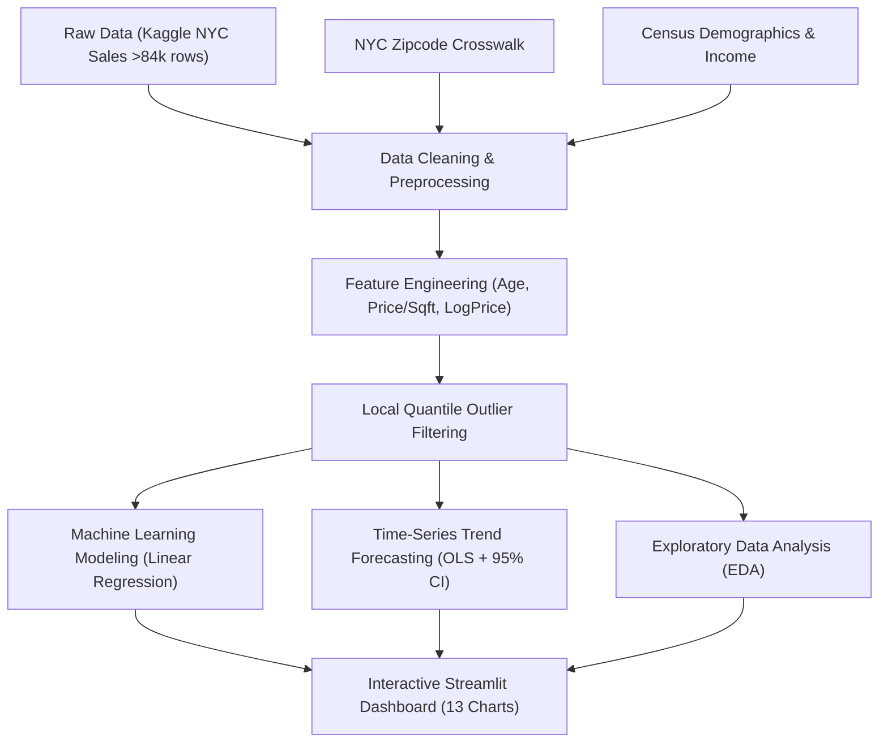

# 🗽 NYC PropVision: Dự Đoán & Trực Quan Hóa Xu Hướng Giá Bất Động Sản New York (AI & Analytics)

> **Đồ Án Cuối Kỳ:** Dự đoán và trực quan hóa xu hướng giá bất động sản tại các đô thị lớn New York theo đặc điểm và vị trí.  
> **Tác giả:** AnthKhoi (Lê Huỳnh Anh Khôi)  
> **Công nghệ:** Python, Streamlit, Plotly, Scikit-Learn, Pandas, NumPy, SciPy.

---

## 📌 1. Giới Thiệu Đề Tài
Thị trường bất động sản Thành phố New York (NYC) là một trong những thị trường tài chính - địa ốc năng động và phức tạp bậc nhất thế giới với hơn 84,000 giao dịch hàng năm phân bổ trên 5 quận lớn: **Manhattan, Brooklyn, Queens, The Bronx, Staten Island**.

Dự án **NYC PropVision** xây dựng một hệ thống khép kín gồm **Data Science Pipeline 4 bước**, kết hợp giữa:
1. **Làm sạch và tích hợp đa nguồn dữ liệu:** Kết nối dữ liệu giao dịch bất động sản với mã bưu chính (Zip Codes) và dữ liệu nhân khẩu học/thu nhập trung vị.
2. **Khám phá dữ liệu chuyên sâu (EDA):** Phân tích phân phối, tương quan đa biến và ngoại lai.
3. **Bảng điều khiển tương tác (Interactive BI Dashboard):** 6 phân hệ nghiệp vụ với 13 biểu đồ tương tác cao cấp (bản đồ địa lý tọa độ, drill-down phân tầng, treemap, heatmap mật độ...).
4. **Mô hình Trí tuệ Nhân tạo & Dự báo (AI Valuation & Forecasting):**
   - **Multiple Linear Regression (Hồi quy tuyến tính đa biến):** Định giá cá thể tài sản dựa trên phương trình hồi quy toán học giữa diện tích, tuổi thọ, thu nhập khu vực và vị trí quận.
   - **Hồi quy chuỗi thời gian OLS:** Dự báo xu hướng giá và số lượng giao dịch tương lai kèm **Khoảng tin cậy 95% (95% Confidence Interval)** và kiểm định ý nghĩa thống kê ($p$-value, $R^2$).

---

## 🏗️ 2. Kiến Trúc Pipeline Hệ Thống



---

## 📊 3. Tính Năng & Danh Mục 13 Biểu Đồ Trực Quan

Hệ thống dashboard tương tác phân chia thành 6 Tab chức năng:

| Tab | Tên Phân Hệ | Biểu Đồ & Chức Năng |
|---|---|---|
| **Tab 1** | Xu Hướng Thị Trường & Thị Phần | 1. Biểu đồ Miền (Area Chart) doanh số theo tháng.<br>2. Biểu đồ Vành khuyên (Donut Chart) thị phần quận.<br>3. Biểu đồ Đường (Line Chart) diễn biến đơn giá/sqft. |
| **Tab 2** | Phân Bố Không Gian & Vị Trí | 4. Bản đồ Địa lý tương tác (Scatter Map) tọa độ giao dịch.<br>5. Mật độ nhiệt 2 chiều (Density Heatmap) Tuổi thọ vs Đơn giá. |
| **Tab 3** | Cấu Trúc Đô Thị & Drill-Down | 6. Biểu đồ Treemap phân cấp TP -> Quận -> Khu phố.<br>7. Biểu đồ Cột ngang (Horizontal Bar) Top 10 khu phố đắt nhất.<br>+ Thanh tra chi tiết từng quận (District Inspector). |
| **Tab 4** | Đặc Điểm Công Trình & Quy Mô | 8. Biểu đồ Cột đứng giá theo phân nhóm diện tích.<br>9. Biểu đồ Hộp (Box Plot) phân phối log giá 5 quận.<br>10. Biểu đồ Tần suất (Histogram) đơn giá/sqft. |
| **Tab 5** | Học Máy Định Giá Bất Động Sản | 11. Biểu đồ Hồi quy OLS (Diện tích vs Giá).<br>12. Đối chiếu Giá thực tế vs Hồi quy Tuyến tính Dự báo (Đường chuẩn $y=x$).<br>+ Công cụ mô phỏng định giá & dự phóng tăng trưởng. |
| **Tab 6** | Dự Báo Xu Hướng Thị Trường | 13. Dự báo xu hướng chuỗi thời gian kèm Khoảng tin cậy 95% ($t$-distribution), đo kiểm $p$-value và $R^2$. |

---

## 🧠 4. Hiệu Quả Mô Hình Hồi Quy Tuyến Tính (Linear Regression Metrics)

Mô hình được huấn luyện và đánh giá khách quan trên tập kiểm thử độc lập (Test set 20%):

- **Thuật toán cốt lõi:** `Multiple Linear Regression` (Hồi quy tuyến tính đa biến)
- **Phương trình toán học:** $\ln(\text{Giá}) = \beta_0 + \sum \beta_i \cdot X_i$
- **Hệ số chặn (Intercept $\beta_0$):** `13.4263`
- **Hệ số xác định ($R^2$ Score):** `0.243` trên log giá
- **Sai số tuyệt đối trung bình (MAE):** `$456,646 USD`
- **Sai lệch phần trăm trung vị (MedAPE):** `33.3%`
- **Hệ số tác động hồi quy ($\beta_i$):**
  1. Vị trí Quận Manhattan (`Quan_Manhattan`): `+1.7057` (Tác động tăng giá mạnh nhất)
  2. Thu nhập hộ gia đình (`MEDIAN_HOUSEHOLD_INCOME`): `+0.000004` (Tác động tăng giá)
  3. Vị trí Quận Brooklyn (`Quan_Brooklyn`): `-0.0373`
  4. Vị trí Quận Queens (`Quan_Queens`): `-0.4186`
  5. Vị trí Quận Bronx (`Quan_Bronx`): `-0.5417`
  6. Vị trí Quận Staten Island (`Quan_Staten Island`): `-0.7080`

---

## 🚀 5. Hướng Dẫn Cài Đặt & Khởi Chạy

### Yêu Cầu Môi Trường
- Python 3.10 trở lên (khuyến nghị Python 3.11 - 3.14 64-bit).
- Hệ điều hành: Windows / macOS / Linux.

### Bước 1: Clone kho mã nguồn
```bash
git clone https://github.com/AnthKhoi/NYC_PropVision.git
cd NYC_PropVision
```

### Bước 2: Cài đặt thư viện phụ thuộc
```bash
pip install -r requirements.txt
```

### Bước 3: Huấn luyện mô hình AI (Tạo file trọng số `nyc_rf_model.pkl`)
```bash
python train_model.py
```

### Bước 4: Khởi chạy Giao diện Dashboard Streamlit
```bash
streamlit run app.py
```
> Hoặc trên Windows, bạn chỉ cần click đúp chuột vào tệp **`run.bat`** để tự động kiểm tra và khởi động hệ thống.

---

## 📂 6. Cấu Trúc Thư Mục Dự Án

```
NYC_PropVision/
├── app.py                       # Mã nguồn chính giao diện Streamlit Dashboard & 13 biểu đồ
├── train_model.py               # Kịch bản tự động lọc dữ liệu, train và lưu mô hình AI
├── XULY_DATA.ipynb              # Notebook quy trình tiền xử lý, kết nối 3 bảng và EDA
├── requirements.txt             # Danh sách thư viện Python cần thiết
├── run.bat                      # File thực thi 1-click khởi động dự án trên Windows
├── .gitignore                   # Cấu hình bỏ qua file lớn (>100MB) và file văn bản
├── README.md                    # Tài liệu hướng dẫn đồ án
├── images/                      # Hình ảnh sơ đồ kiến trúc và biểu đồ phân tích
├── final_dashboard_data.csv     # Dữ liệu sạch đã qua Feature Engineering
├── nyc-rolling-sales.csv        # Dữ liệu thô ban đầu từ Kaggle (>84,000 dòng)
├── NYC Zipcodes - NYC Zip 2020.csv # Dữ liệu ánh xạ bưu chính New York
└── nyc_demographics.csv         # Dữ liệu nhân khẩu học và thu nhập
```

---

## 📜 7. Giấy Phép & Bản Quyền
Dự án được phát hành theo giấy phép [MIT License](LICENSE).
Mọi đóng góp và trích dẫn vui lòng ghi rõ nguồn tác giả.
